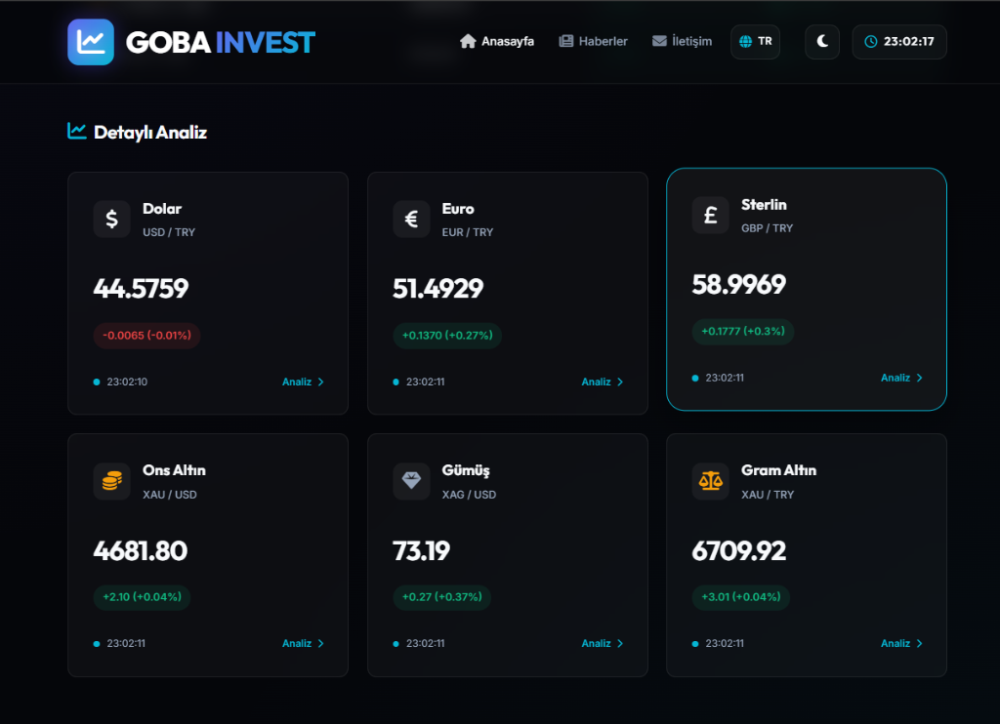
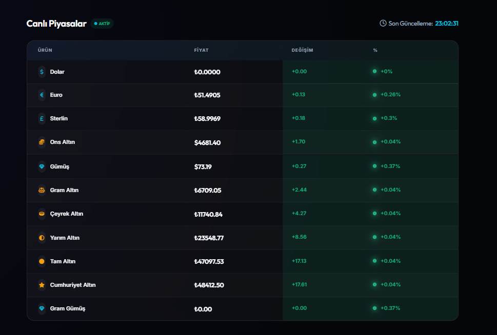
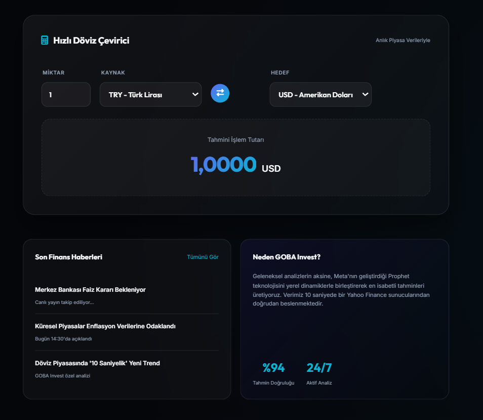
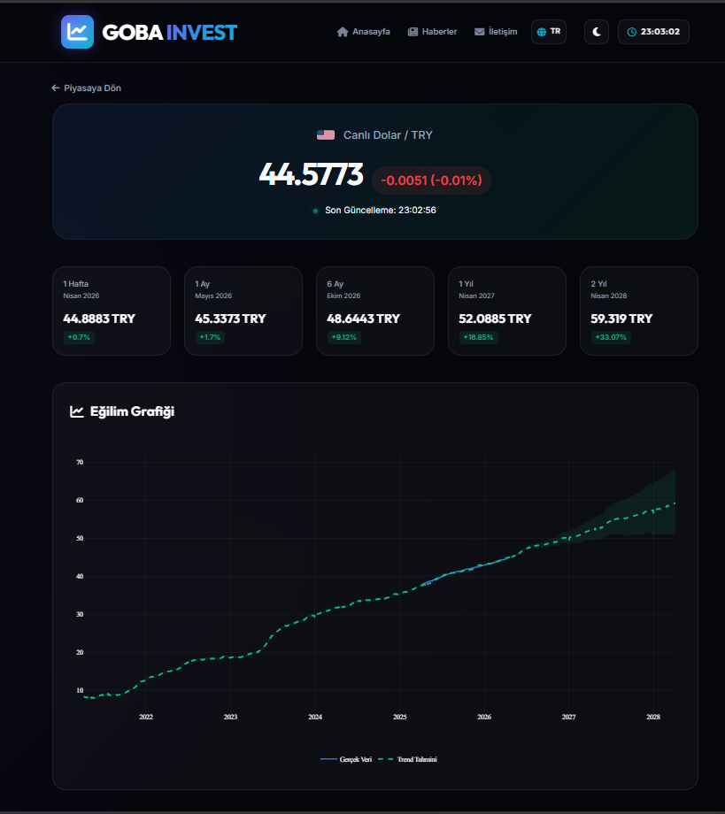

# 📈 GOBA INVEST - Profesyonel Döviz Analiz ve Tahmin Platformu

<div align="center">
  
  
  
  
</div>

---

## 🚀 Proje Hakkında

**GOBA INVEST**, döviz piyasalarını yapay zeka ile analiz eden, anlık veriler sunan ve geleceğe yönelik projeksiyonlar hazırlayan yeni nesil bir finansal analiz platformudur. Geleneksel yöntemlerin aksine, Meta'nın geliştirdiği **Prophet** kütüphanesini kullanarak 2 yıla kadar uzanan isabetli tahminler üretir.

### ✨ Temel Özellikler

- 🤖 **Yapay Zeka Destekli Tahmin:** Facebook (Meta) Prophet algoritmaları ile 1 haftadan 2 yıla kadar döviz ve emtia projeksiyonları.
- ⚡ **10 Saniyelik Veri Güncelleme:** Yahoo Finance API üzerinden her 10 saniyede bir güncellenen canlı piyasa verileri.
- 📊 **İnteraktif Grafikler:** Plotly kütüphanesi kullanılarak oluşturulan, teknik analiz odaklı interaktif grafik arayüzü.
- 💱 **Hızlı Döviz Çevirici:** Anlık kurlar üzerinden hesaplama yapan, kullanıcı dostu döviz çevirici.
- 🌗 **Karanlık/Aydınlık Tema:** Göz yormayan, premium "Glassmorphism" tasarımı ve tema desteği.
- 🌐 **Çoklu Dil Desteği:** Türkçe ve İngilizce dil seçenekleri.
- 💹 **Geniş Ürün Yelpazesi:** USD, EUR, GBP, Ons Altın, Gümüş, Gram Altın ve türev altın ürünleri (Çeyrek, Yarım, Cumhuriyet vb.).

---

## 🛠️ Teknoloji Yığını

- **Backend:** Python / Flask
- **Veri & Analiz:** Pandas, Requests, yfinance
- **Yapay Zeka:** Facebook Prophet (Time Series Forecasting)
- **Frontend:** HTML5, Modern CSS (Glassmorphism), Vanilla JavaScript
- **Görselleştirme:** Plotly.js
- **İkonlar:** FontAwesome 6


---

## 📸 Ekran Görüntüleri

<div align="center">
  <h3>📊 Detaylı Analiz Paneli</h3>
  
  <p><em>Piyasa verilerinin görselleştirildiği premium kart tasarımı.</em></p>
  
  <br>

  <h3>📋 Canlı Piyasalar Tablosu</h3>
  
  <p><em>USD, EUR, GBP ve Altın/Gümüş ürünlerinin anlık takibi.</em></p>

  <br>

  <h3>💱 Hızlı Çevirici ve Haberler</h3>
  
  <p><em>Anlık kurlar üzerinden çalışan hesap makinesi ve finans haberleri.</em></p>

  <br>

  <h3>📈 Yapay Zeka Tahmin Grafiği</h3>
  
  <p><em>Prophet algoritması ile oluşturulan 2 yıllık trend analizi.</em></p>
</div>

---

## 📂 Proje Yapısı

```text
├── app.py              # Ana Flask uygulama sunucusu ve AI modelleri
├── requirements.txt    # Gerekli kütüphanelerin listesi
├── static/
│   ├── css/            # Stil dosyaları
│   ├── js/             # Frontend mantığı ve AJAX güncellemeleri
│   └── docs/img/       # README görselleri
├── templates/          # HTML arayüz dosyaları
└── docs/               # Teknik dokümantasyon (ekran görüntüleri vb.)
```

---

## 🔌 API Referansı

Platform, dış entegrasyonlar için temel bir API sunmaktadır:

| Endpoint | Metot | Açıklama |
| :--- | :--- | :--- |
| `/api/rates` | `GET` | Tüm canlı döviz ve altın kurlarını JSON formatında döner. |

---

## 🗺️ Yol Haritası

- [ ] 📱 **Mobil Uygulama:** Flutter veya React Native ile mobil destek.
- [ ] 🔔 **Fiyat Alarmları:** Belirli bir kur seviyesine ulaşıldığında e-posta/push bildirimi.
- [ ] 💹 **Portföy Yönetimi:** Kullanıcıların kendi varlıklarını takip edebileceği bir panel.
- [ ] 🤖 **Daha Fazla Model:** LSTM ve ARIMA gibi farklı AI modelleri ile hibrit tahminleme.

---
## 📧 İletişim

**Eren Görkem Çolak** - [GitHub](https://github.com/gorkemcolakk) - [LinkedIn](https://www.linkedin.com/in/eren-g%C3%B6rkem-%C3%A7olak-06104b35a/)

*"Finansal geleceğinizi yapay zeka ile öngörün."*
